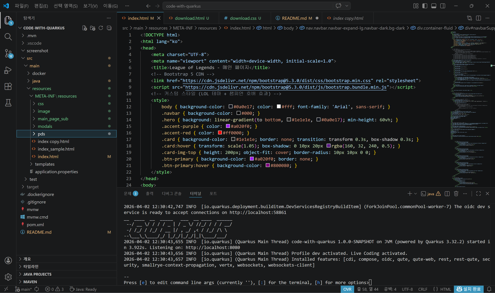
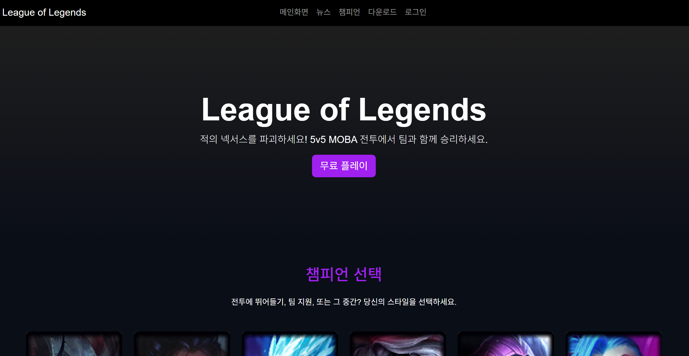
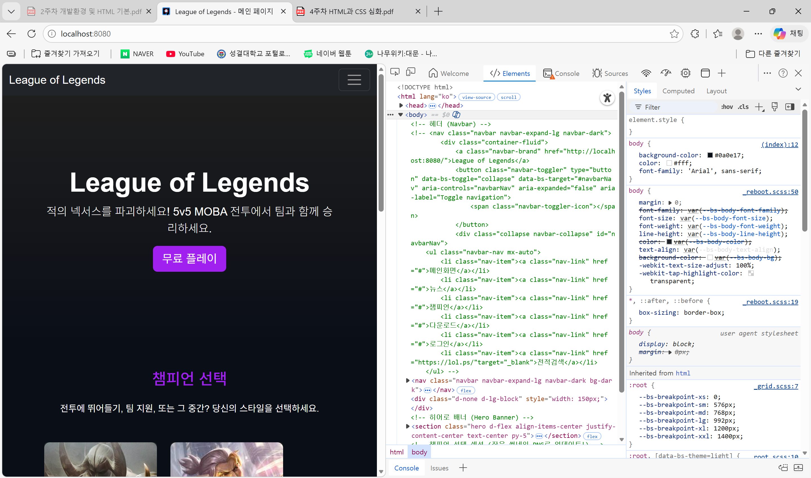
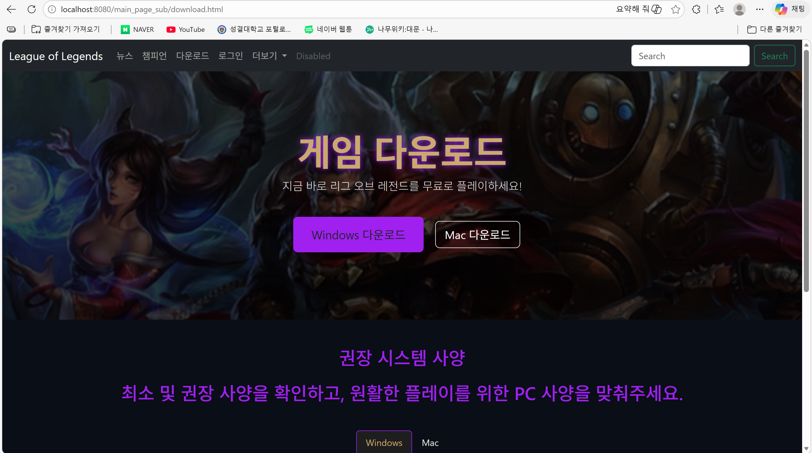
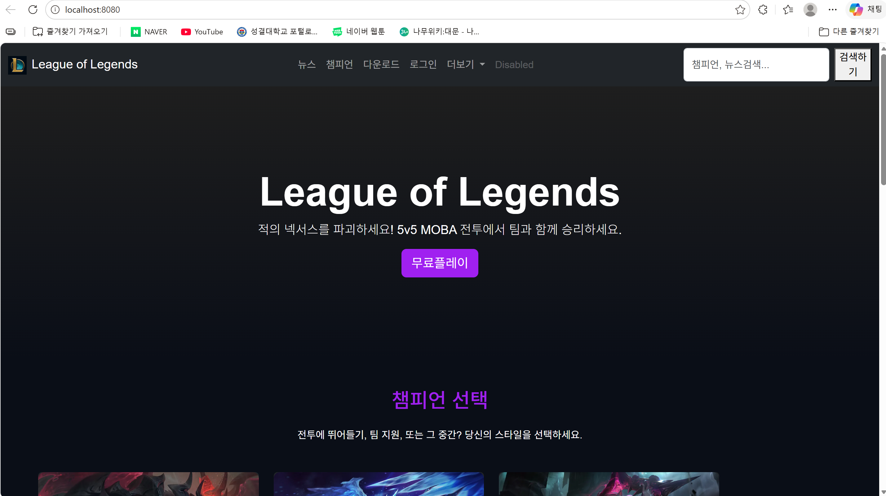
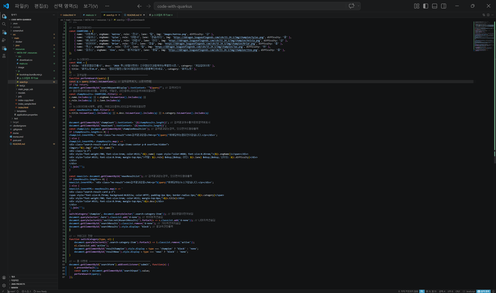
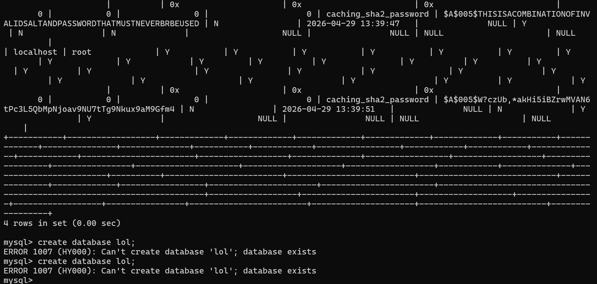
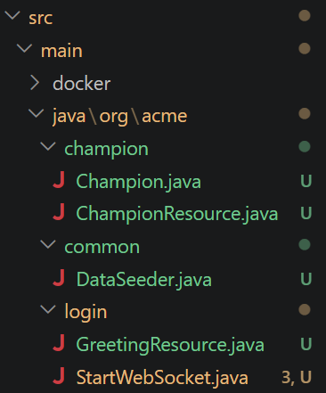
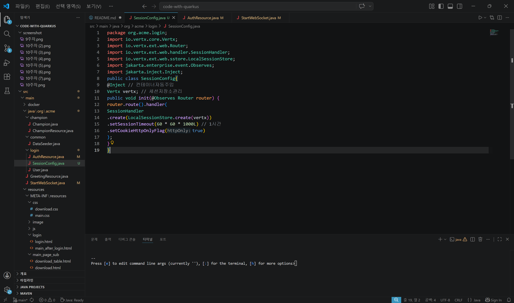

# Quarkus프로젝트 개발환경 구축 (학번:20250583 이름:하성욱 )
Quarkus 프레임워크 설치 및 터미널을 이용한 초기 빌드 환경 세팅
## 2주차수업내용
실습1 : quarkus 개발 환경 구축
실습2 : 터미널을 이용하여 빌드시작
<divalign="center">

 
## 2주차수업내용
테스트

# 메인페이지 구현 (학번:20250583 이름:하성욱 )
리그 오브 레전드 메인 UI 설계 및 GitHub 원격 저장소 연동
## 3주차수업내용
실습1 : LOL 메인페이지 구현
실습2: 카드 상세보기
실습3 : 네비게이션 바 중앙 이동
실습4: 사진 업로드
실습5: 링크 달기
실습6: 깃허브 업로드
과제1 : 여러챔피언 이미지 넣어보기
<divalign="center">

 
## 3주차수업내용
테스트

# 부트스트랩 사용 (학번:20250583 이름:하성욱 )
Bootstrap 컴포넌트를 활용한 디자인 수정 및 개발자 도구 코드 분석
## 4주차수업내용
실습1 : 부트스트랩 사용하여 디자인 변경
실습2 : 하이퍼링크 이미지 연결
실습3 : 개발자 모드로 코드 해석하기
<divalign="center">

 
## 4주차수업내용
테스트

# 서브페이지 구현 (학번:20250583 이름:하성욱 )
독립된 서브 화면 연결 및 챔피언별 상세 정보 모달창 구현
## 5주차수업내용
실습1 : 모달창 구현
실습2 : 서브페이지구현
실습3 : css파일 연결
과제1 : 네비게이션 바 중앙 이동
과제2 : 챔피언 10명 상세정보 모달 구현
<divalign="center">

 
## 5주차수업내용
테스트

# 자바스크립트 (학번:20250583 이름:하성욱 )
외부 JS 파일 연동을 통한 동적 이벤트 제어 및 검색창 기초 설계
## 6주차수업내용
실습1 : 자바 스크립트 연결, 활용
실습2 : 검색창 구현
실습3 : 서브 페이지 구현 (다운로드 화면)
과제1 : 네비바 가운데 정렬
과제2 : 네비바 안에 LOL로고 삽입
과제3 : 챔피언 상세 정보 모달 구현(5주차 스크린샷 포함)
<divalign="center">

 
## 6주차수업내용
테스트

# 검색 구현 (학번:20250583 이름:하성욱 )
search.js 기반 챔피언 검색 알고리즘 구현 및 조건별 화면 전환 처리
## 7주차수업내용
실습1 : search.js 스크립트 수정
실습2 : mian.css 파일 생성
실습3 : 검색 구현
과제1 : 챔피언 이름 입력후 화면출력
과제2 : 검색어가 없거나 공백인 경우 메인화면으로 돌아가기
과제3 :showMainScreen() 함수를 만들고 performSearch에서 q가 없으면 호출
과제4 : 클릭 →기존 section이 다시 보이게 하기
<divalign="center">

 
## 7주차수업내용
테스트

# 데이터 연동 (학번:20250583 이름:하성욱 )
REST API 접근 경로 등록 및 MySQL 데이터베이스 시스템 구축
실습1 : 다크모드 라이트모드 설정
실습2 : 자바소스코드 접근경로 및 리턴 값 등록
실습3 : MySQL설치
실습4 : 데이터베이스 연동
실습5 : 테이블데이터 삽입
<divalign="center">

 
## 9주차수업내용
테스트

# 로그인 구현 (학번:20250583 이름:하성욱 )
벡엔드 도메인 패키지 아키텍처 설계 및 로그인·로그아웃 엔드포인트 작성
## 10주차수업내용
실습1 : 도매인 패키지 구조
실습2 : 로그인 엔드 포인트 작성
실습3 : 로그인 화면 만들기
실습4 : 로그아웃 설정
실습5 : 임시 사용자 데이터 삽입
<divalign="center">

 
## 10주차수업내용
테스트

# 자바 벡엔드 코딩 (학번:20250583 이름:하성욱 )
세션 기반 회원 인증 시스템 및 네비바 다크·라이트 모드 토글 구현
## 11주차수업내용
실습1 : 세션 활성화 설정 추가
실습2 : DB 사용자 체크
실습3 : 로그인 후 페이지
실습4 : 로그아웃 엔드포인트
과제1 : Dark,Light모드 구현
<divalign="center">

 
## 11주차수업내용
테스트