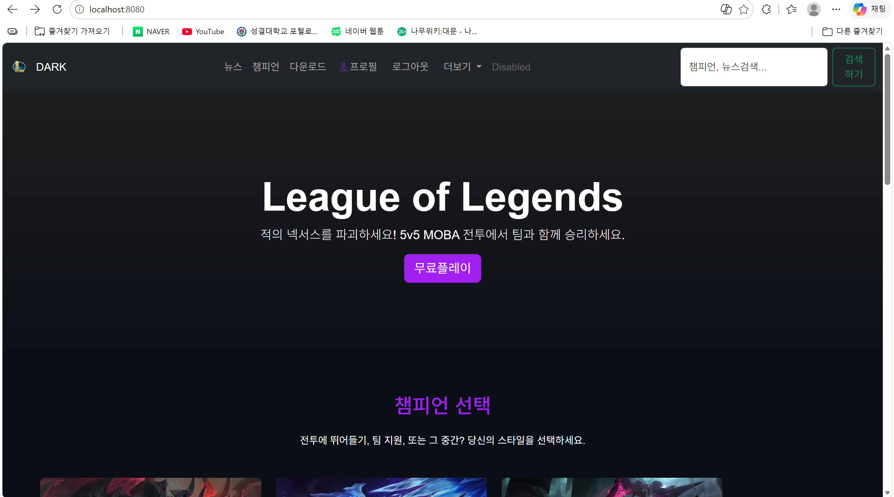
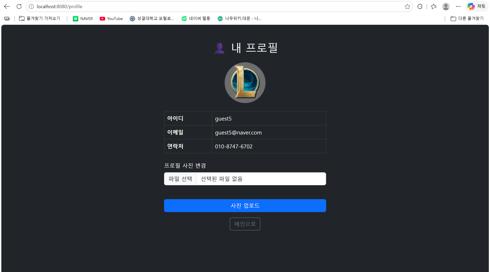

# Quarkus프로젝트 개발환경 구축 (학번:20250583 이름:하성욱 )
2주차에는 Quarkus 프레임워크를 이용한 개발 환경 구축을 진행하였다.
Quarkus를 설치하고 프로젝트 초기 설정을 완료한 뒤, 터미널을 통해 빌드를 실행하는 과정을 실습하였다.
이를 통해 Quarkus 기반의 웹 애플리케이션 개발을 위한 기본적인 환경 세팅 방법을 익혔다.
## 2주차수업내용
실습1 : quarkus 개발 환경 구축
실습2 : 터미널을 이용하여 빌드시작
<divalign="center">

 
느낀점 : 처음으로 Quarkus 환경을 직접 설치해보면서 개발 환경 세팅이 생각보다 복잡하다는 것을 느꼈다.
터미널로 빌드를 실행했을 때 정상적으로 동작하는 것을 확인하고 뿌듯함을 느꼈다.
앞으로 진행할 프로젝트의 기반이 되는 환경을 직접 구성해봤다는 점에서 의미 있는 실습이었다.
## 2주차수업내용

# 메인페이지 구현 (학번:20250583 이름:하성욱 )
3주차에는 리그 오브 레전드 메인 페이지 UI를 직접 설계하고 구현하는 실습을 진행하였다.
Bootstrap을 활용하여 챔피언 카드 상세보기 기능을 구현하고, 네비게이션 바를 중앙 정렬하는 작업을 수행하였다.
또한 챔피언 이미지 및 사진 업로드 기능을 추가하고, 외부 사이트로 연결되는 링크를 달아 페이지를 완성하였다.
실습 완료 후 GitHub 원격 저장소에 업로드하는 과정까지 진행하였으며, 과제로는 여러 챔피언 이미지를 직접 페이지에 넣어보는 작업을 수행하였다.
## 3주차수업내용
실습1 : LOL 메인페이지 구현
실습2: 카드 상세보기
실습3 : 네비게이션 바 중앙 이동
실습4: 사진 업로드
실습5: 링크 달기
실습6: 깃허브 업로드
과제1 : 여러챔피언 이미지 넣어보기
<divalign="center">

 
느낀점 : HTML만으로 페이지를 만드는 것과 Bootstrap을 활용하는 것의 차이를 직접 느낄 수 있었다.
챔피언 카드 상세보기 기능을 구현하면서 컴포넌트 재사용의 편리함을 체감했다.
네비게이션 바를 중앙 정렬하는 과정에서 CSS 속성에 대한 이해가 깊어졌다.
과제로 여러 챔피언 이미지를 직접 넣어보면서 레이아웃을 자유롭게 다루는 능력이 향상된 것 같다.
GitHub에 업로드하는 과정까지 진행하면서 버전 관리의 중요성도 함께 느낄 수 있었다.
## 3주차수업내용

# 부트스트랩 사용 (학번:20250583 이름:하성욱 )
4주차에는 Bootstrap 컴포넌트를 활용하여 메인 페이지의 디자인을 수정하는 실습을 진행하였다.
부트스트랩을 이용한 레이아웃 변경 및 하이퍼링크와 이미지를 연결하는 작업을 수행하였으며,
브라우저 개발자 도구를 통해 HTML/CSS 코드를 직접 분석하고 해석하는 방법을 학습하였다.
## 4주차수업내용
실습1 : 부트스트랩 사용하여 디자인 변경
실습2 : 하이퍼링크 이미지 연결
실습3 : 개발자 모드로 코드 해석하기
<divalign="center">

 
느낀점 : 부트스트랩 컴포넌트를 직접 적용해보니 디자인 작업이 훨씬 수월해졌다.
하이퍼링크와 이미지를 연결하는 실습을 통해 HTML 요소 간의 연결 방식을 다시 한번 정리할 수 있었다.
개발자 도구를 활용해 코드를 직접 분석해보면서 실제 서비스의 코드 구조를 읽는 능력이 생긴 것 같다.
## 4주차수업내용

# 서브페이지 구현 (학번:20250583 이름:하성욱 )
5주차에는 독립된 서브 페이지를 구현하고 챔피언별 상세 정보를 모달창으로 표시하는 기능을 개발하였다.
Bootstrap 모달 컴포넌트를 활용하여 팝업 창을 구현하고, 외부 CSS 파일을 연결하여 스타일을 분리하는 작업을 진행하였다.
과제로는 네비게이션 바를 중앙 정렬하고 챔피언 10명의 상세 정보 모달을 직접 구현하였다.
## 5주차수업내용
실습1 : 모달창 구현
실습2 : 서브페이지구현
실습3 : css파일 연결
과제1 : 네비게이션 바 중앙 이동
과제2 : 챔피언 10명 상세정보 모달 구현
<divalign="center">

 
느낀점 : 모달창을 처음 구현해보면서 사용자 인터페이스 설계의 중요성을 느꼈다.
Bootstrap 모달 컴포넌트를 활용해 팝업 창을 만드는 방법을 익히면서 라이브러리 활용 능력이 향상됐다.
CSS 파일을 분리하여 관리하니 코드가 훨씬 정리되는 것을 체감할 수 있었다.
과제로 챔피언 10명의 상세 정보 모달을 직접 구현하면서 반복 작업을 통해 코드 작성 속도가 빨라졌다.
네비게이션 바 중앙 정렬 과제를 수행하면서 Bootstrap 그리드 시스템에 대한 이해가 깊어졌다.
## 5주차수업내용

# 자바스크립트 (학번:20250583 이름:하성욱 )
6주차에는 외부 JavaScript 파일을 연동하여 동적 이벤트를 제어하는 방법을 학습하였다.
검색창 기초 기능을 설계하고 다운로드 화면 서브 페이지를 구현하는 실습을 진행하였다.
과제로는 네비게이션 바 가운데 정렬, LOL 로고 삽입, 챔피언 상세 정보 모달 구현을 수행하였다.
## 6주차수업내용
실습1 : 자바 스크립트 연결, 활용
실습2 : 검색창 구현
실습3 : 서브 페이지 구현 (다운로드 화면)
과제1 : 네비바 가운데 정렬
과제2 : 네비바 안에 LOL로고 삽입
과제3 : 챔피언 상세 정보 모달 구현(5주차 스크린샷 포함)
<divalign="center">

 
느낀점 : JavaScript 파일을 외부로 분리해서 연동하는 방식을 익히면서 유지보수의 편리함을 느꼈다.
검색창 기초 기능을 설계하면서 사용자 입력값을 처리하는 방법을 처음으로 경험할 수 있었다.
다운로드 화면 서브 페이지를 구현하면서 페이지 간 이동과 링크 연결 구조를 이해하게 됐다.
과제로 네비게이션 바에 LOL 로고를 삽입하면서 이미지 요소를 HTML에 자연스럽게 녹이는 방법을 익혔다.
챔피언 상세 정보 모달을 추가로 구현하면서 지난 주차 내용을 복습하고 더 완성도 있게 다듬을 수 있었다.
## 6주차수업내용

# 검색 구현 (학번:20250583 이름:하성욱 )
7주차에는 search.js 스크립트를 수정하여 챔피언 검색 알고리즘을 구현하고, main.css 파일을 새로 생성하여 검색 결과 화면의 스타일을 적용하였다.
과제로는 챔피언 이름 입력 후 결과를 화면에 출력하고, 검색어가 없거나 공백인 경우 메인 화면으로 돌아가는 기능을 구현하였다.
또한 showMainScreen() 함수를 직접 작성하고 카테고리 클릭 시 기존 섹션이 다시 표시되도록 처리하였다.
## 7주차수업내용
실습1 : search.js 스크립트 수정
실습2 : mian.css 파일 생성
실습3 : 검색 구현
과제1 : 챔피언 이름 입력후 화면출력
과제2 : 검색어가 없거나 공백인 경우 메인화면으로 돌아가기
과제3 :showMainScreen() 함수를 만들고 performSearch에서 q가 없으면 호출
과제4 : 클릭 →기존 section이 다시 보이게 하기
<divalign="center">

 
느낀점 : search.js 스크립트를 직접 수정하면서 검색 알고리즘의 동작 원리를 이해할 수 있었다.
main.css 파일을 새로 생성하고 검색 결과 화면에 스타일을 적용하면서 CSS 설계 능력이 향상됐다.
검색어가 없거나 공백인 경우 메인 화면으로 돌아가는 예외 처리를 구현하면서 사용자 경험을 고려한 코딩의 중요성을 느꼈다.
showMainScreen() 함수를 직접 설계하고 performSearch 함수와 연결하면서 함수 간의 호출 흐름을 명확히 이해할 수 있었다.
카테고리 클릭 시 기존 섹션이 다시 표시되도록 처리하면서 DOM 조작에 대한 자신감이 붙었다.
과제를 통해 단순한 검색 기능이 아닌 조건에 따라 화면이 전환되는 동적인 페이지를 직접 완성할 수 있어서 성취감이 컸다.
## 7주차수업내용

# 데이터 연동 (학번:20250583 이름:하성욱 )
9주차에는 REST API 접근 경로를 등록하고 MySQL 데이터베이스 시스템을 구축하는 실습을 진행하였다.
다크모드와 라이트모드 전환 기능을 구현하고, Java 소스코드에서 접근 경로 및 리턴 값을 등록하였다.
MySQL을 설치하고 Quarkus 프로젝트와 데이터베이스를 연동한 뒤 테이블에 데이터를 삽입하는 전체 과정을 실습하였다.
## 9주차수업내용
실습1 : 다크모드 라이트모드 설정
실습2 : 자바소스코드 접근경로 및 리턴 값 등록
실습3 : MySQL설치
실습4 : 데이터베이스 연동
실습5 : 테이블데이터 삽입
<divalign="center">

 
느낀점 : 데이터베이스를 처음으로 직접 연동해보면서 백엔드와 프론트엔드가 어떻게 연결되는지 이해할 수 있었다.
MySQL 설치부터 Quarkus 프로젝트와의 연동, 테이블 데이터 삽입까지 전체 흐름을 경험하니 웹 개발의 전체 구조가 보이기 시작했다.
다크모드와 라이트모드 전환 기능을 구현하면서 CSS 변수와 JavaScript를 함께 활용하는 방법을 익혔다.
Java 소스코드에서 접근 경로와 리턴 값을 직접 등록해보면서 REST API의 기본 구조를 처음으로 경험할 수 있었다.
## 9주차수업내용

# 자바 백엔드 코딩 (학번:20250583 이름:하성욱 )
10주차에는 백엔드 도메인 패키지 아키텍처를 설계하고 로그인·로그아웃 기능의 엔드포인트를 직접 작성하였다.
로그인 화면을 구현하고 세션 활성화 설정을 추가하였으며, 임시 사용자 데이터를 삽입하여 DB 기반 사용자 인증 흐름을 구현하였다.
과제로는 Dark/Light 모드 전환 기능을 구현하였다.
## 10주차수업내용
실습1 : 도매인 패키지 구조
실습2 : 로그인 엔드 포인트 작성
실습3 : 로그인 화면 만들기
실습4 : 로그아웃 설정
실습5 : 임시 사용자 데이터 삽입
실습6 : 세션 활성화 설정 추가
실습7 : DB 사용자 체크
실습8: 로그인 후 페이지
실습9 : 로그아웃 엔드포인트
과제1 : Dark, Light 모드 구현
<divalign="center">

 
느낀점 : 백엔드 도메인 패키지 구조를 설계하면서 실제 프로젝트에서 코드를 어떻게 체계적으로 관리하는지 이해할 수 있었다.
로그인과 로그아웃 엔드포인트를 직접 작성하면서 HTTP 요청과 응답의 흐름을 명확히 파악할 수 있었다.
세션 활성화 설정을 추가하고 DB 기반 사용자 인증을 구현하면서 보안과 상태 관리의 중요성을 깨달았다.
임시 사용자 데이터를 삽입하고 실제로 로그인이 동작하는 것을 확인했을 때 뿌듯함이 컸다.
과제로 Dark/Light 모드 전환 기능을 구현하면서 사용자 편의를 고려한 UI 설계 방법을 익힐 수 있었다.
## 10주차수업내용

# 회원가입 (학번:20250583 이름:하성욱 )
11주차에는 회원가입 기능을 전반적으로 구현하였다.
회원가입 버튼 추가부터 register, register_check, register_success 엔드포인트를 순서대로 등록하고,
회원 테이블을 수정하여 입력값 유효성 검사와 SHA-256 해시 암호화를 적용하였다.
dev 모드에서 실제 가입이 정상적으로 이루어지는지 확인하였으며, 과제로는 로그인 입력값 체크 및 에러 메시지 처리를 구현하였다.
## 11주차수업내용
실습1 : 회원가입 버튼 추가
실습2 : register 엔드포인트 등록
실습3 : 회원가입 화면 작성
실습4 : 회원 테이블 수정
실습5 : 입력 값 유효성 검사
실습6 : SHA-256해시, 모달창
실습7 : register_check 엔드포인트 등록
실습8 : register_success 엔드포인트 등록
실습9 : dev모드에서 가입 확인
과제1 : 로그인 입력값 체크 및 에러 메시지 처리
<divalign="center">

 
느낀점 : 회원가입 기능을 처음부터 끝까지 직접 구현하면서 엔드포인트 설계의 전체 흐름을 체계적으로 익힐 수 있었다.
register, register_check, register_success 엔드포인트를 순서대로 등록하면서 백엔드 로직이 단계별로 어떻게 처리되는지 이해하게 됐다.
입력값 유효성 검사를 적용하면서 사용자가 잘못된 값을 입력했을 때 이를 어떻게 처리해야 하는지 배울 수 있었다.
SHA-256 해시 암호화를 직접 적용해보면서 비밀번호 보안의 중요성과 암호화 방식에 대해 관심이 생겼다.
dev 모드에서 실제 가입이 정상적으로 이루어지는 것을 확인했을 때 한 단계 완성된 서비스를 만든 것 같아 보람을 느꼈다.
## 11주차수업내용

# 프로필화면 연동 (학번:20250583 이름:하성욱 )
12주차에는 로그인 후 프로필 화면과 연동하는 작업을 진행하였다.
네비게이션 바에 프로필 링크를 추가하고, 프로필 화면에서 회원 정보를 불러오는 기능을 구현하였다.
또한 로그인 유효성 검사를 적용하였으며, 과제로는 로그인 오류 시 에러 메시지를 출력하고 사진 업로드 에러 메시지를 표시하는 기능을 구현하였다.
## 12주차수업내용
실습1 : 네이게이션바에 프로필 링크 추가
실습2 : 프로필화면 연동
실습3 : Dev ui 새로운 필드 확인
실습4 : 로그인 유효성 검사
과제1 : 로그인 오류시 오류 메세지 출력 (실습4에서 메세지 바뀜)
과제2 : 사진 업로드 에러 메세지 출력
<divalign="center">

 
느낀점 : 네비게이션 바에 프로필 링크를 추가하고 실제 회원 정보를 화면에 불러오면서 프론트와 백엔드가 자연스럽게 연결되는 경험을 할 수 있었다.
Dev UI에서 새로운 필드를 확인하는 과정을 통해 Quarkus 개발 도구 활용 방법을 익혔다.
로그인 유효성 검사를 적용하면서 사용자 입력 처리의 중요성을 다시 한번 느꼈다.
과제로 로그인 오류 시 에러 메시지를 출력하고 사진 업로드 에러 메시지를 표시하는 기능을 구현하면서 사용자에게 명확한 피드백을 제공하는 것이 얼마나 중요한지 깨달았다.
실습과 과제를 통해 실제 서비스에서 자주 사용되는 오류 처리 패턴을 직접 구현해볼 수 있어서 유익했다.
## 12주차수업내용

# 회원관리 페이지 (학번:20250583 이름:하성욱 )
13주차에는 프로필 화면에서 회원 정보 수정 기능을 구현하고, 네비게이션 바에 로그인한 사용자명을 동적으로 표시하는 기능을 추가하였다.
기존 HTML에서 사용하던 브라우저 기본 alert() 함수를 Bootstrap 기반의 Toast 알림으로 교체하였으며,
test.js에 showToast 함수를 추가하여 여러 페이지에서 재사용할 수 있도록 구성하였다.
## 13주차수업내용
실습1 : 회원관리 페이지에서 회원정보 수정
실습2 : 네비바의 사용자명 동적 표시
실습3 : HTML에서 alert()지우고 showToast()로 수정
실습4 : test.js에서 showToast함수 추가하기
실습5 : 브라우저 기본 알림창 추가
<divalign="center">

 
느낀점 : 회원 정보 수정 기능을 구현하면서 기존에 저장된 데이터를 불러오고 수정하는 전체 흐름을 익힐 수 있었다.
네비게이션 바에 로그인한 사용자명을 동적으로 표시하면서 JavaScript로 DOM을 실시간으로 조작하는 방법을 다시 한번 확인할 수 있었다.
alert() 대신 Bootstrap Toast 알림으로 교체하면서 브라우저 기본 팝업보다 훨씬 자연스러운 사용자 경험을 제공할 수 있다는 것을 배웠다.
showToast 함수를 test.js에 추가하여 여러 페이지에서 재사용 가능하도록 설계하면서 함수의 범용성과 코드 재사용의 중요성을 느꼈다.
한 학기 동안 프론트엔드 UI 설계부터 JavaScript 동적 처리, Java 백엔드 개발, 데이터베이스 연동까지 웹 개발의 전체 흐름을 직접 경험할 수 있어서 매우 유익한 수업이었다.
## 13주차수업내용